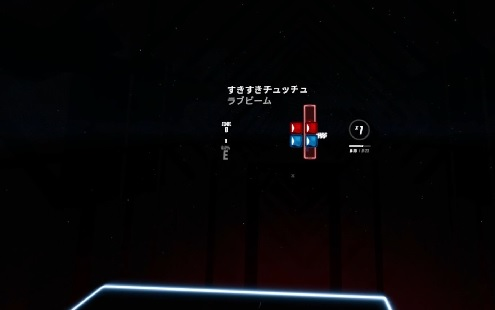
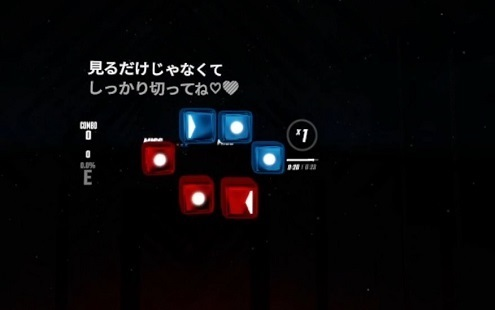

[English version of README is here](README.md)

# LyricsBoard

LyricsBoardはBeat Saberでプレイ中の曲の歌詞を表示できるmodです。
VRカラオケにどうぞ。

<video controls src="https://user-images.githubusercontent.com/93933541/218266178-6b3ab2b6-f9e3-4cdf-9d01-6884560ebee6.mp4" muted="true"></video>

<video controls src="https://user-images.githubusercontent.com/93933541/218266181-ce039246-6622-430d-a436-d8105494ffd7.mp4" muted="true"></video>

## インストール

### 前提

LyricsBoardが動作するには、BSIPAやほかの依存modがBeat Saberにインストールされていることが必要です。
[Mod Assistant](https://github.com/Assistant/ModAssistant) を使ってインストールしておいてください。

### 手動インストール

LyricsBoardのインストール方法は、ほかの手動インストールが必要なタイプのmodと同じです。

- [Release Page](https://github.com/kan8pachi/LyricsBoard/releases) から、LyricsBoardをダウンロードしてください。
  ほとんどの方には、最新のバージョンがおすすめです。

- ダウンロードしたzipを解凍し、mod用フォルダに展開します。
  Steamの場合、フォルダはここにあることが多いです: `\steamapps\common\Beat Saber\`

その後、いつものようにBeat Saberを起動すると、LyricsBoardが動いているはずです。

なお、modは必ず正しい場所からダウンロードしているか確認してください。
信頼できないサイトから入手したmodを使うのは、とても危険です。

## 設定とデータ

- LyricsBoardは、ここの設定を読み込みます: `\steamapps\common\Beat Saber\UserData\LyricsBoard.json`
  存在しなければ、自動で作られます。
  ほとんどの設定値はゲーム内のBSML設定タブから変更できるため、このファイルは特に手動で修正する必要はありません。

- 歌詞データは自分で用意してくださいね。歌詞データの定義方法は、[このページ](docs/lyrics-ja.md)を参照してください。
