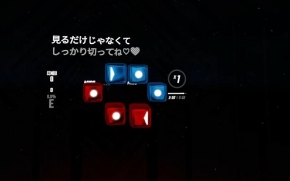

[日本語版 README はこちら](README-ja.md)

# LyricsBoard

LyricsBoard is a Beat Saber mod that just display the lyrics of the playing song.
Enjoy karaoke time in VR!

<video controls src="https://user-images.githubusercontent.com/93933541/218266178-6b3ab2b6-f9e3-4cdf-9d01-6884560ebee6.mp4" muted="true"></video>

<video controls src="https://user-images.githubusercontent.com/93933541/218266181-ce039246-6622-430d-a436-d8105494ffd7.mp4" muted="true"></video>

## Install

### Prerequisites

Prior to installing LyricsBoard, BSIPA and other prerequisite mods must be present in your Beat Saber.
Make sure to install them with [Mod Assistant](https://github.com/Assistant/ModAssistant).

### Manual Install

Installation process of LyricsBoard is the same as the other mods that require manual install.

- Download the copy of LyricsBoard mod from our [Release Page](https://github.com/kan8pachi/LyricsBoard/releases).
  The latest release is the best choise in most cases.

- Extract the downloaded zip and deploy the contents into the mods folder.
  The folder location for Steam is typically here: `\steamapps\common\Beat Saber\`.

Then launch Beat Saber as usual. You will see LyricsBoard working.

Please double check that you are downloading the mod from the right source since the installation of an mod from an untrusted site is potentially vulnerable for your PC.

## Config and Data

- LyricsBoard loads the config file from this locataion: `\steamapps\common\Beat Saber\UserData\LyricsBoard.json`
  It will be generated automatically if not exist.
  You don't need to modify it manually since you can set most of the configuration parameters graphically at the configuration tab in the BSML setting view in game.

- You need to prepare the lyrics data by yourself. How to define lyrics data is described in [this document](docs/lyrics.md).
